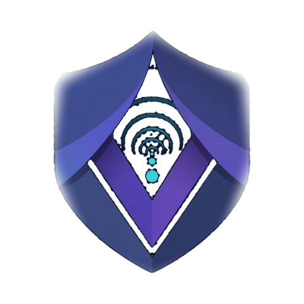

<p align="center">
  
</p>

<h1 align="center">VEIL</h1>

<p align="center">
  A private, DPI-resistant network tunnel — the protocol core.
</p>

---

**VEIL** is a WireGuard-class VPN protocol designed to avoid known
WireGuard/OpenVPN wire signatures while preserving high-performance private
networking. This repository is the **protocol core**: an OS-independent Go
library that the platform clients build on.

> VEIL is designed to avoid known WireGuard/OpenVPN wire signatures while
> preserving high-performance private networking. It does not claim to be
> invisible, undetectable, or unblockable.

## What makes the wire different from WireGuard

- **Elligator2-encoded handshake ephemerals** — the handshake's public keys are
  indistinguishable from uniform random bytes to a passive observer.
- **Per-packet pseudorandom tags** — instead of a static cleartext receiver
  index, every transport packet carries a fresh BLAKE2s tag, so flows can't be
  correlated by a constant field.
- **Network secret folded into the KDF from message one** — a per-network shared
  secret gates the handshake before any DH work.
- **Length-bucketed handshakes + size-quantized transport padding** — message
  sizes don't leak type or inner packet length in default deployments.
- **Monotonic handshake replay protection** — a captured handshake can't be
  replayed to fingerprint an endpoint later.

Crypto primitives match WireGuard (ChaCha20-Poly1305 AEAD, BLAKE2s KDF,
X25519), so the security foundation is the same; the differences are in the
*wire image*, not the cryptography.

## Packages

| Package | Responsibility |
|---------|----------------|
| `core` | Handshake state machine, Elligator2, key schedule |
| `transport` | Per-packet tags, nonces, AEAD encap/decap, replay window |
| `engine` | OS-independent data plane: peer/tag/routing tables, the three hot loops, path-MTU probing, fragmentation, stats. Drives any `engine.Tun` + `*net.UDPConn` |
| `config` | `.conf` / config-text parsing |
| `link` | `veil://` shareable config links |

The `engine` is deliberately free of OS integration: `engine.New` takes an
`engine.Tun` interface and a `*net.UDPConn`, so the platform repositories
(below) provide the concrete TUN device and routing.

## Clients built on this

| Repo | What |
|------|------|
| [veil-linux](https://github.com/veil-proto/veil-linux) | Linux CLI client (`veil-daemon`) |
| [veil-windows](https://github.com/veil-proto/veil-windows) | Windows CLI client |
| [veil-windows-gui](https://github.com/veil-proto/veil-windows-gui) | Windows GUI client (window + tray, MSI installer) |
| [veil-install](https://github.com/veil-proto/veil-install) | Server installer / configurator, `veil://` + QR generation |

Each pins this module at the tip of `main`:

```
go get github.com/veil-proto/veil@main
```

## Using it as a library

```go
import (
    "github.com/veil-proto/veil/config"
    "github.com/veil-proto/veil/engine"
)

cfg, _ := config.LoadConfig("veil.conf")
eng, _ := engine.New(cfg, myTunDevice /* implements engine.Tun */, udpConn)
errCh := make(chan error, 2)
eng.Run(errCh)
```

## Build & test

```
go build ./...
go test ./...
```

## Versioning

Calendar versioning `YY.M.D` (e.g. `26.7.3`). CI builds and tests every commit;
tagged releases are cut manually.

## License

MIT — see [LICENSE](LICENSE). (Default choice; open to change.)
